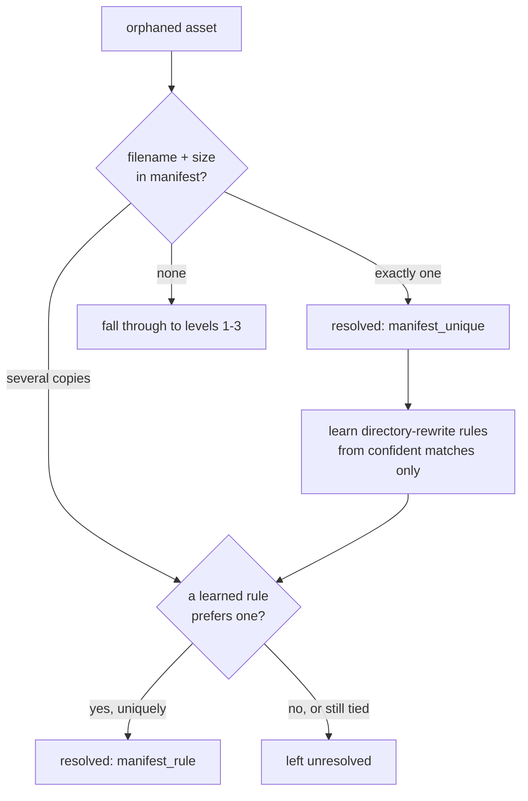
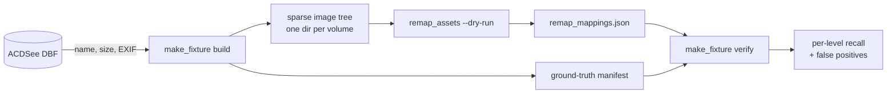

# ACDSee Database Export

One-time export of all photo/video metadata from an ACDSee 2023 database into a portable SQLite file.

## Background

ACDSee stores metadata (ratings, categories, captions, EXIF, IPTC, GPS, face detections, etc.) in a proprietary Visual FoxPro database on the local machine. This project extracts that metadata into SQLite so it can be queried, migrated, or imported into other software without needing ACDSee.

## What's in the database

ACDSee's database is a directory of `.dbf` / `.cdx` / `.fpt` files (Visual FoxPro format). The export script reads all metadata tables and writes them to a single `.sqlite` file, preserving all records losslessly. Thumbnail and face-embedding binary data is intentionally skipped.

### Tables exported (non-empty)

| Table | Records | Description |
|-------|--------:|-------------|
| Asset | 171,594 | Core file metadata: name, folder, dimensions, dates, rating, caption, notes, tags |
| AssetExif | 141,129 | Camera EXIF: make, model, orientation, maker notes |
| ExifImage | 139,051 | Detailed EXIF: exposure, aperture, focal length, ISO, lens info |
| AssetIPTC | 28,378 | IPTC: keywords, location, copyright, captions |
| ExifGPS | 14,843 | GPS coordinates and related fields |
| JoinCategoryAsset | 13,777 | Category-to-asset assignments |
| Face | 11,493 | Face bounding boxes per image |
| JoinAssetFTSWordTable | 11,194 | Full-text search word-to-asset index |
| AssetMedia | 10,476 | Video/audio properties (duration, frame rate, codec, MP3 tags) |
| Folder | 8,798 | Folder hierarchy |
| FTSWordTable | 2,975 | Full-text search word dictionary |
| LookupValueItem | 697 | Enum values assigned to assets |
| Category | 647 | Hierarchical categories (tree structure via `PRNT_ID`) |
| LookupListItem | 387 | Enum value definitions |
| FileType | 269 | File extension-to-type mappings |
| JoinAssetTypeFileType | 173 | Asset type-to-file type join |
| LookupList | 48 | Enum list definitions |
| FolderRoot | 35 | Drive/volume roots |
| CategoryRoot | 16 | Category root groups |
| Collection | 7 | Named collections |
| CollectionQuery | 6 | Smart collection query rules |

Plus several reference/config tables and two metadata tables (`_column_mapping`, `_export_info`).

### Tables skipped

| Table | Size | Reason |
|-------|-----:|--------|
| Thumb1, Thumb2, Thumb3 | ~6.9 GB | Cached thumbnail images |
| FaceThumbnail | 416 MB | Face crop images |
| FaceDescriptor | 12 MB | Face recognition embedding vectors |

## How it works

ACDSee uses Visual FoxPro field types that standard DBF readers don't handle. The export script (`export_to_sqlite.py`) includes a custom field parser for:

- **Type 7 (DateTime)**: 8 bytes split into Julian Day Number + milliseconds since midnight, converted to ISO 8601 strings
- **Type B (Double)**: used for IDs and numeric values; IDs are cast to integers
- **Type I (Integer)**: 32-bit signed integers

The script also:

- Renames opaque `COL00xxx` column names to human-readable names (e.g. `COL00064` becomes `Exposure_Time`) using ACDSee's internal `FieldSetField` mapping table
- Handles Windows cp1252 encoding with replacement for unmappable bytes
- Creates indexes on key join columns (`ASSET_ID`, `FOLDER_ID`, `CAT_ID`, etc.)
- Stores the original-to-display column name mapping in a `_column_mapping` table

## Usage

### Prerequisites

```
python3 -m venv .venv
source .venv/bin/activate
pip install dbfread
```

### Running the export

```
python export_to_sqlite.py
```

This reads from `acdsee_source/Default/` and writes `acdsee_export_<YYYYMMDD_HHMMSS>.sqlite` in the current directory. Pass an alternate source path as the first argument:

```
python export_to_sqlite.py /path/to/acdsee/Default
```

### Querying the export

```sql
-- Reconstruct full file paths
SELECT fr.NAME || '/' || f.NAME || '/' || a.NAME AS path,
       a.RATING, a.CAPTION, a.EXIFDATE
FROM Asset a
JOIN Folder f ON a.FOLDER_ID = f.FOLDER_ID
JOIN FolderRoot fr ON f.FOLD_RT_ID = fr.FOLD_RT_ID
WHERE a.WIDTH > 0
LIMIT 10;

-- List categories assigned to a file
SELECT c.NAME AS category
FROM JoinCategoryAsset jca
JOIN Category c ON jca.CAT_ID = c.CAT_ID
WHERE jca.ASSET_ID = 12345;

-- Find photos with GPS data
SELECT a.NAME, g.GPS_Latitude, g.GPS_Longitude
FROM ExifGPS g
JOIN Asset a ON g.ASSET_ID = a.ASSET_ID
WHERE g.GPS_Latitude IS NOT NULL;

-- Browse the category tree
SELECT c.CAT_ID, c.NAME, p.NAME AS parent
FROM Category c
LEFT JOIN Category p ON c.PRNT_ID = p.CAT_ID
ORDER BY c.CAT_ID;
```

## Source data

The `acdsee_source/Default/` directory contains a working copy of the ACDSee database from the source PC. It is not modified by the export script.

---

# Asset Path Remapping

Remap orphaned asset paths when images have moved to a new location.

When using ACDSee with external storage (NAS, USB drives, or migrated
volumes), the database records reference the original paths.  If a drive
letter changes, a volume is renamed, or images are moved to a new
filesystem, ACDSee loses the connection to those files.  `remap_assets.py`
finds the current locations of orphaned assets and updates the database
in place so that ACDSee sees them again.

## Resolution Levels

| Level | Strategy | Example |
|-------|----------|---------|
| **1** — Path prefix remap | Volume/drive letter changed or folder renamed.  The filename and relative path are unchanged. | `D:\Photos\2023\img.jpg` → `/nas/photos/Photos/2023/img.jpg` |
| **2** — File match by name + metadata | File moved elsewhere; confirmed by matching file size, dimensions, EXIF datetime, and camera make/model. | Same filename found in a different folder, verified via EXIF. |
| **3** — Metadata-only EXIF signature | File was renamed and/or modified (cropped, edited).  Matched on DateTimeOriginal + camera make/model. | Finds the same photo even if the filename and size differ. |

## Prerequisites

```
python3 -m venv .venv
source .venv/bin/activate
pip install -r requirements.txt
```

## Usage

```
python remap_assets.py <db_dir> <image_root> [options]
```

**Always run with `--dry-run` first** to preview changes before writing:

```
python remap_assets.py acdsee_source/Default /mnt/nas/photos --dry-run --level 1
```

### Options

| Option | Default | Description |
|--------|---------|-------------|
| `--level {1,2,3}` | `1` | Maximum resolution level |
| `--manifest PATH` | none | exiftool JSON manifest; enables offline resolution |
| `--manifest-root P` | inferred | Path prefix in the manifest matching `image_root` |
| `--dry-run` | off | Report only; do not modify the database |
| `--no-backup` | off | Skip creating a database backup before writing |
| `--workers N` | `4` | Number of parallel workers for filesystem scanning |
| `--log-file PATH` | auto | Custom log file path |
| `--verbose` | off | Detailed diagnostic output |
| `--gui` | off | Launch tkinter GUI instead of CLI |

## Manifest mode (recommended for network storage)

Walking a NAS over SMB costs about 440 filenames per second, and opening
files to read EXIF costs about **2.4 per second** — a full pass over a
165,000-asset library would take the better part of a day.  Almost all of
that is network latency, not work.

`--manifest` moves the expensive part to the machine that owns the disks.

### Generating the manifest

Run this **on the NAS itself**, not over the mount — that is the whole point.
This is the command used to produce the reference manifest for this
repository, on the Synology (`Miracle`), against the `photo` share:

```bash
exiftool -r -q -j -n \
  -FileSize -DateTimeOriginal -CreateDate -Make -Model -LensModel \
  -FocalLength -FNumber -ImageWidth -ImageHeight \
  /volume1/photo > exif_manifest.json
```

| Flag | Why it matters |
|------|----------------|
| `-r` | Recurse the whole share |
| `-j` | JSON output — what `--manifest` parses |
| `-n` | **Required.** Emits raw numbers, so `FileSize` is an integer of bytes rather than a human string like `153 KiB`. Size matching depends on this. |
| `-q` | Suppress progress chatter so the JSON stays clean |

The tag list is the minimum the resolver uses.  Extra tags are harmless;
omitting `-FileSize` breaks matching entirely.

> **Write the output outside the tree you are scanning.** The reference run
> wrote `exif_manifest.json` into `/volume1/photo`, so exiftool scanned its
> own half-written output and emitted a final record with garbage EXIF
> parsed out of the JSON bytes. `ManifestIndex` drops any record whose
> filename matches the manifest's own, so this is handled — but writing to
> `/volume1/homes/` or piping elsewhere avoids it cleanly.

The result for a 165,000-asset library is roughly 111 MB of JSON, about
5 MB gzipped — a trivial copy compared to the 14 TB it describes.

### Using it

Then remap entirely offline:

```bash
python remap_assets.py acdsee_source/Default /mnt/nas/photo \
    --manifest exif_manifest.json --level 3 --dry-run
```

Every filesystem question — does this path exist, how big is it, what EXIF
does it carry — is answered from the manifest, so the run touches the
network zero times.

### How it resolves



Matching on filename **and** size is a verified match, not a guess.  Rules
are learned only from assets that matched unambiguously, so the tie-breaker
is never trained on its own guesses.  Anything still tied is left
unresolved rather than assigned to an arbitrary copy.

When several copies share a name and size, a candidate sitting exactly
where the database says — relative to its volume — wins before any rule is
consulted.  That is the asset's own file, not a duplicate of it.

### Expect many-to-one results

The database catalogued the same photo from several drives (`E:`, `D:`,
`\\Miracle` all held copies) while the migrated storage keeps one.  On the
reference library, **31,528 files are each claimed by 2–5 assets**, covering
half of all resolutions.  That is the migration's deduplication showing
through, not a matching error, but it does mean those assets become
multiple records pointing at a single file.  The run reports the count
before writing anything.

The rules it learns are the reorganisation that happened to your library —
for example `E:/Photos/photos/0ur camera` → `0ur camera/prior to current
year`.  They are reported in the log and stored in the mappings JSON.

### Manifest hygiene

Synology shares carry an `@eaDir` thumbnail directory beside every image;
on the reference library those accounted for **356,000 of 476,000** records.
They are filtered on load, along with system directories and the manifest's
own JSON file (exiftool will scan its own output if written in place).

### Examples

```bash
# Preview what would change (safe, recommended first step)
python remap_assets.py acdsee_source/Default /mnt/nas/photos --level 2 --dry-run

# Apply changes with backup
python remap_assets.py acdsee_source/Default /mnt/nas/photos --level 2

# Skip backup (use with caution)
python remap_assets.py acdsee_source/Default /mnt/nas/photos --level 1 --no-backup
```

## How It Works

### Volume Identification

ACDSee identifies volumes by their Windows Volume Serial Number (stored
as `DISC_ID` in the `FolderRoot` table).  The database links asset
information to `volume_serial + path + filename`.  The remap tool uses
path and filename matching rather than serial number lookup, which makes
it robust across filesystem migrations.

### Filesystem Scanning

When `--level 2` or higher is used, the tool walks the entire image root
to build an index of filenames.  Directories named `@eaDir`, `#recycle`,
`.DS_Store`, `System Volume Information` and similar are automatically
skipped.

Network storage (NAS over OpenVPN/SMB) is supported with automatic retry
on transient I/O errors (EIO, ESTALE, ENETRESET).

### Database Updates

For Level 1 matches, the tool updates `FolderRoot.NAME` and propagates
prefix mappings through the cache so that all assets under the same
prefix are quickly resolved.  New folder records are created in the
`Folder` table hierarchy when needed.

For Level 2/3 matches, `Asset.FOLDER_ID` is updated (and `Asset.NAME` if
renamed).  After writing, `.cdx` index files are deleted; ACDSee rebuilds
them on next launch.

### Output Files

Two files are produced per run:

- `remap_YYYYMMDD_HHMMSS.log` — detailed resolution log with per-file info
- `remap_mappings_YYYYMMDD_HHMMSS.json` — discovered prefix mappings and resolved paths (for audit)

## Testing

```bash
python -m unittest test_remap_assets -v
```

Fast unit tests cover path mapping, directory filtering, signature
matching, and filesystem operations.  Database-loading integration tests
require the `acdsee_source/` directory and take longer to run — roughly
11 minutes, because each test method reloads the full database in `setUp`.

---

# Fixture Generator

`make_fixture.py` builds a synthetic image tree from the database so the
remapper can be tested end-to-end without touching the real photo storage.

## Why it works

The remapper only reads three things from the filesystem: directory entry
names, file sizes, and JPEG EXIF headers.  It never decodes pixel data.
So a faithful stand-in costs about 800 bytes per asset — recorded sizes are
reproduced with **sparse files**, which report the right size while
allocating almost no blocks.

The full 165,214-asset library is 1.17 TB on disk.  The fixture reproduces
every one of those sizes in roughly half a gigabyte of real disk, with no
network access at all.



## Perturbation buckets

Because the tree is generated from the database, the correct answer is
known for every asset up front.  A seeded fraction of assets is deliberately
disturbed so each resolution level has something to find:

| Bucket | Disturbance | Should resolve at |
|--------|-------------|-------------------|
| `pristine` | none — file sits where the database says | **L1** (drive-letter roots) or **L2** (UNC roots) |
| `moved` | relocated to `<volume>/_relocated/`, name kept | **L2** |
| `renamed` | prefixed `RN_`, left in place | **L3** |
| `deleted` | never created | must stay **unresolved** |

Each volume root (`E:`, `D:`, `\\Miracle`, …) becomes its own top-level
directory, mirroring a migration where every old drive lands as a separate
share.  Merging them would overlay same-named files from different volumes
and manufacture ambiguity the real storage does not have.

## Usage

```bash
# 1. build a fixture (default 2000 assets; --limit 0 for all 165k)
python make_fixture.py build acdsee_source/Default /tmp/fixture --limit 3000

# 2. confirm the fixture itself is sound before trusting a result
python make_fixture.py self-check /tmp/fixture/fixture_manifest.json

# 3. run the remapper against it
python remap_assets.py acdsee_source/Default /tmp/fixture --level 3 --dry-run

# 4. score the run against ground truth
python make_fixture.py verify /tmp/fixture/fixture_manifest.json \
    remap_mappings_20260814_151817.json
```

`verify` exits non-zero when it finds a false positive — a resolution
pointing at the wrong file — so it works as a regression gate.

### Options for `build`

| Option | Default | Description |
|--------|---------|-------------|
| `--limit N` | `2000` | Assets to include; `0` for the whole database |
| `--seed S` | `1` | Sampling and bucket assignment are deterministic |
| `--moved F` | `0.10` | Fraction relocated within their volume |
| `--renamed F` | `0.05` | Fraction renamed in place |
| `--deleted F` | `0.03` | Fraction never created |
| `--workers N` | `8` | Parallel file creation |

### Reading the verify output

`correct_L1` / `correct_L2` / `correct_L3` are hits at the expected level.
`missed_L*` means the asset was findable but was not found — a recall
problem.  `FALSE_POSITIVE_*` means the remapper resolved an asset to the
**wrong file**, which is the serious one: applied for real, it repoints a
database record at somebody else's photo.

On a sampled fixture, claims against assets outside the sample are labelled
`CROSS_ASSET_sampling_artifact` rather than counted as false positives —
those assets would have had their own files in a full run.  Use `--limit 0`
for a true precision figure.

### Known limitation

Assets inside archives (ACDSee indexes `foo.zip/bar.jpg`) cannot be
materialised, because `foo.zip` would have to be both a file and a
directory.  They are skipped, listed in the manifest's
`excluded_asset_ids`, and discounted during verification.
